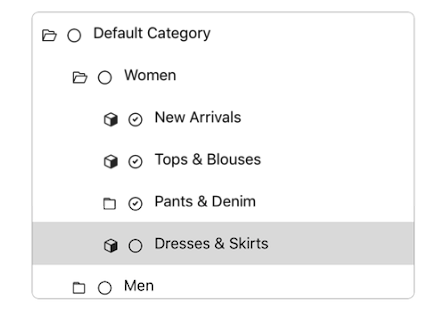

UITreeView
===========

UITreeView is a Tree view component in iOS, similar to the TreeView control in Windows. It is a implementation based on UITableView.

Adding UITreeView to your project
====================================

The simplest way to add the UITreeView to your project is to directly add the `UITreeView` folder with source filees and resources to your project.

1. Download the latest code version from the repository (you can simply use the Download Source button and get the zip or tar archive of the master branch).
2. Extract the archive.
3. Open your project in Xcode, then drag and drop the `UITreeView` folder, with all of its contents, to your classes group (in the Groups & Files view). 
4. Make sure to select Copy items when asked. 

If you have a git tracked project, you can add UITreeView as a submodule to your project. 

1. Move inside your git tracked project.
2. Add UITreeView as a submodule using `git submodule add https://github.com/OneSecure/UITreeView.git UITreeView` .
3. Open your project in Xcode, then drag and drop the `UITreeView` folder to your classes group (in the Groups & Files view). 
4. Don't select Copy items and select a suitable Reference type (relative to project should work fine most of the time). 

Usage
=====

A demo project is included in the Demo directory. This should give you an idea how to use the class. 

License and Warranty
====================

The license for the code is included with the project; it's basically a BSD license with attribution.

You're welcome to use it in commercial, closed-source, open source, free or any other kind of software, as long as you credit me appropriately.

The UITreeView code comes with no warranty of any kind. I hope it'll be useful to you (it certainly is to me), but I make no guarantees regarding its functionality or otherwise.

Change-log
==========

**Version 0.2** @ 01.30.17

- Rewrite and rename to UITreeView

Thanks
======

* Varun Naharia, from the project. https://github.com/varun-naharia/VNTreeView

